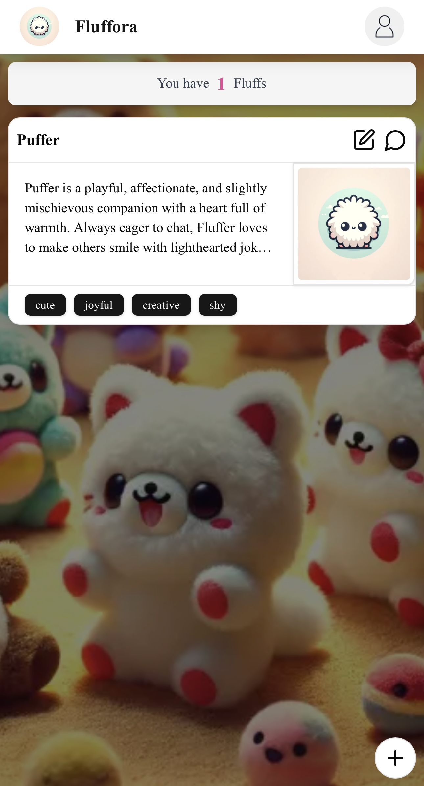
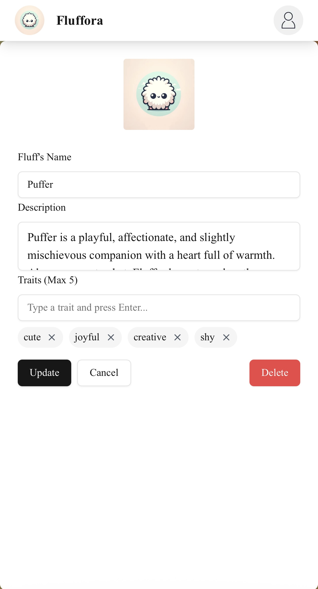
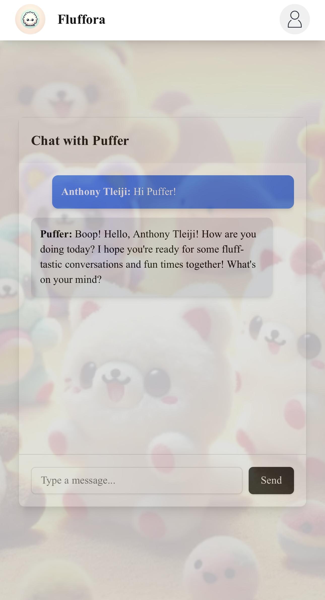

# Fluffora 🧸✨

Bring your plushies to life with AI! Fluffora lets users **upload images of their plushies** and **chat with them** using AI-powered interactions. Built with modern web technologies, Fluffora provides a seamless and engaging experience for users.

---

## 📸 Preview

<p align="center">
  
  
  
  
</p>

---

## 🚀 Tech Stack

Fluffora is powered by a robust stack to ensure performance, scalability, and an engaging user experience:

- **Next.js 15** – Server Components, API routes, caching
- **Lucia Auth** – Secure authentication with Google OAuth
- **Prisma** – Database ORM with PostgreSQL
- **React Query** – Efficient data fetching and state management
- **Amazon S3** – Image uploads and storage
- **OpenAI API** – AI-powered chat interactions
- **Framer Motion & Tailwind CSS** – Beautiful UI animations and styling

---

## 📌 Features

✅ **User Authentication** – Google OAuth via Lucia Auth  
✅ **Upload Plushie Images** – Stored securely on AWS S3  
✅ **AI Chat System** – Conversations powered by OpenAI  
✅ **Real-Time UI Updates** – React Query with optimistic UI  
✅ **Role-Based Access** – Admin, Tester, and User permissions  
✅ **Pagination & Infinite Scrolling** – Fast and efficient loading  
✅ **Optimistic UI** – Instant updates when adding/deleting fluffs

---

## 🛠 Installation & Setup

1. Clone the repository:

   ```sh
   git clone https://github.com/AnthonyTlei/fluffora.git
   cd fluffora
   ```

2. Install dependencies:

   ```sh
   npm install
   or
   npm install --legacy-peer-deps
   ```

3. Set up environment variables:

   ```env
   # Vercel Postgres
   DATABASE_URL=""

   # Google OAuth
   GOOGLE_CLIENT_ID=""
   GOOGLE_CLIENT_SECRET=""

   # Other
   NEXT_PUBLIC_BASE_URL=""

   # Amazon S3
   AWS_S3_REGION=""
   AWS_S3_ACCESS_KEY_ID=""
   AWS_S3_SECRET_ACCESS_KEY=""
   AWS_S3_BUCKET_NAME=""

   # Open AI
   OPENAI_API_KEY=""
   ```

4. Run database migrations:

   ```sh
   npx prisma migrate dev
   ```

5. Start the development server:
   ```sh
   npm run dev
   ```

---

## 🎥 Live Demo

_Add a link to a live demo of Fluffora if available_

---
